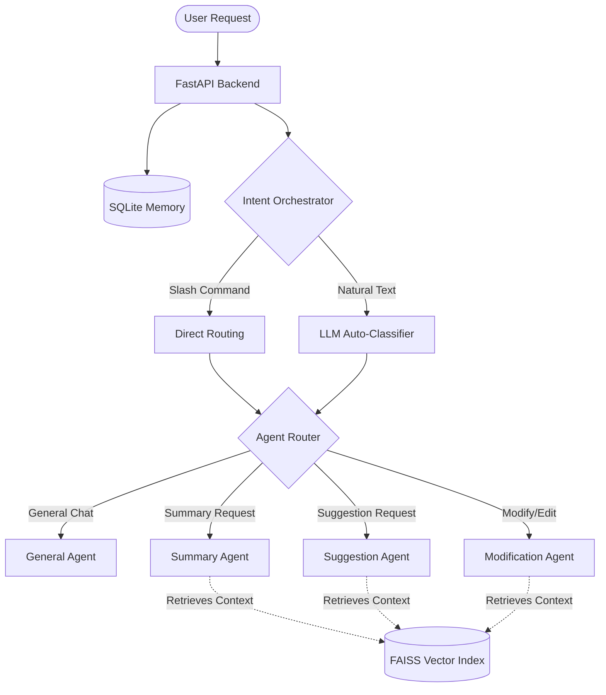

# RAG Agent
> An Enterprise-Grade Multi-Agent RAG Chatbot


RAG Agent is a powerful AI chatbot that uses Retrieval-Augmented Generation (RAG) to provide highly context-aware responses based on your documents. Designed for enterprise use, it features a multi-agent architecture to dynamically route user queries to the best specialized agent.

## Key Features
- **Multi-Agent Architecture:** Dynamically routes queries to Specialist Agents (Summary, Suggestion, Modification).
- **LangGraph State Machine:** Complex agent looping and evaluation (e.g. Critic Agent reviewing and rejecting drafts) is seamlessly managed via LangGraph.
- **Document Ingestion:** Upload PDF, DOCX, and XLSX files to dynamically create a FAISS vector database. Each conversation has its own dedicated document context.
- **Persistent Memory:** SQLite database keeps track of user conversations, chat history, and uploaded files.
- **Provider Agnostic:** Supports multiple LLM providers (Ollama, OpenAI, Groq, Google Gemini).
- **Enterprise UI:** Professional, responsive dark-mode web interface with glassmorphism, live routing workflow indicators, side-by-side document viewer, and latency tracking.
- **Conversational General Agent:** Features a custom-tuned personality that engages in lively conversation when no document is loaded.

---

## System Architecture

The core of RAG Agent is built on an intelligent orchestration layer using **LangGraph**. User queries are either routed explicitly via Slash Commands, or dynamically analyzed and routed to the most appropriate AI agent based on the intent.



---

## Interactive Slash Commands

Control the conversation and bypass the auto-classifier by using built-in slash commands directly in the chat input:

- `/chat [message]` — Have a general conversation without querying your uploaded document.
- `/summary [message]` — Force route to the **Summary Agent** to condense complex information.
- `/suggest [message]` — Force route to the **Suggestion Agent** to receive improvements and ideas based on the text.
- `/modify [message]` — Force route to the **Modification Agent** to rewrite or edit a section of your document.
- `/status` — Instantly check backend health, which document is currently loaded, and how many chunks are indexed in the FAISS database.
- `/clear` — Clear the current conversation and start fresh.
- `/help` — Display an in-chat reference guide for all commands.

---

## Quick Start (Local)

### 1. Prerequisites
- Python 3.10+

### 2. Installation
```bash
# Clone the repository
git clone https://github.com/amishipatidar/rag-agent.git
cd rag-agent

# Activate Virtual Environment
python -m venv venv
# On Windows: .\venv\Scripts\activate
# On Mac/Linux: source venv/bin/activate

# Install Dependencies
pip install -r requirements.txt
```

### 3. Environment Variables
Copy the `.env.example` file to `.env` and configure it. You only need to provide the API keys for the providers you intend to use.

```ini
# --- Example .env ---

# API Keys for Cloud LLM Providers
OPENAI_API_KEY="your_openai_api_key"
GROQ_API_KEY="your_groq_api_key"
GOOGLE_API_KEY="your_gemini_api_key"

# (Optional) Local LLM Configuration
OLLAMA_BASE_URL="http://localhost:11434"
```

### 4. Running the Application
Start the FastAPI backend (this will also serve the frontend UI and automatically initialize the local SQLite database):
```bash
uvicorn backend.api:app --host 0.0.0.0 --port 8000 --reload
```
Navigate to `http://localhost:8000` to interact with the RAG Agent!

---

## Deployment
This repository is pre-configured for easy deployment on **Railway** and **Render**.

### Deploy to Railway
1. Connect your GitHub repository to Railway.
2. Railway will automatically detect the `railway.toml` file and build the project.
3. Add your environment variables (from `.env`) in the Railway dashboard.
4. Add a **Persistent Volume** mounted to `/app/data` to ensure your SQLite database and FAISS vector indices survive redeployments.

---

## Project Structure
* `backend/` - FastAPI server, LangChain agents, FAISS pipeline, and SQLite database setup.
* `frontend/` - Enterprise UI built with vanilla HTML/CSS/JS (modern dark theme).
* `data/` - (Git Ignored) Stores the SQLite DB (`ragflow.db`) and FAISS index files.

## License
Distributed under the MIT License. See `LICENSE` for more information.
